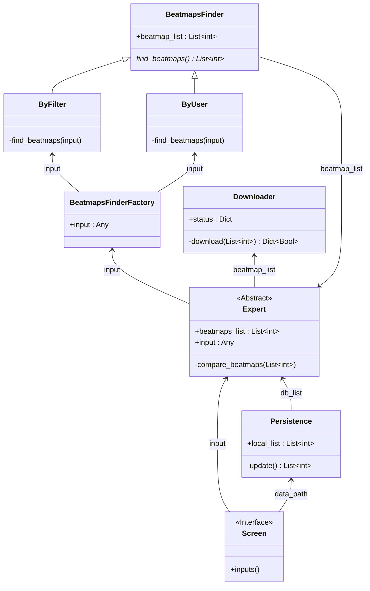

```mermaid
classDiagram
    %% Beatmap is also called beatmap for legibility
    BeatmapsFinder <|-- ByUser
    BeatmapsFinder <|-- ByFilter
    BeatmapsFinderFactory <-- Expert : input
    ByFilter <-- BeatmapsFinderFactory : input
    ByUser <-- BeatmapsFinderFactory : input
    Expert <-- Screen : input
    Expert <-- Persistence : db_list
    Downloader <-- Expert : beatmap_list
    Expert <-- BeatmapsFinder : beatmap_list
    Persistence <-- Screen : data_path

    class BeatmapsFinder{
        +beatmap_list : List~int~
        find_beatmaps()* List~int~
    }
    class ByUser{
        -find_beatmaps(input)
    }
    class ByFilter{
        -find_beatmaps(input)
    }
    class Screen{
        <<Interface>>
        +inputs()
    }
    class Persistence{
        +local_list : List~int~
        -update() List~int~
    }
    class Downloader{
        +status : Dict
        -download(List~int~) Dict~Bool~
    }
    class Expert{
        <<Abstract>>
        +beatmaps_list : List~int~
        +input : Any
        -compare_beatmaps(List~int~)
    }
    class BeatmapsFinderFactory{
        +input : Any
    }

```
